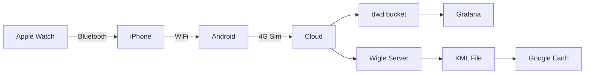

# COBI App

An Angular app to run as a COBI module (Bosch eBike motors) sending data to Bucket.

Available on GitHub Pages: [https://datacentricdesign.github.io/cobi-app](https://datacentricdesign.github.io/cobi-app)

Requirements: NodeJS

## Get Started

Fork and clone this repository on your machine, and open the folder in an IDE such as VS Code. In the IDE, open a Terminal Window and type in:

```sh
npm install
npm start
```

Go to [http://localhost:4200/cobi-app](http://localhost:4200/cobi-app) to see the app in action.

## What's in it?

This repo contains an Angular skeleton for a Bucket Web application.

- Top structure: generic app component / routes / module / service (include service for the settings and token for the oauth2 'code' flow)

- **landing-page component**: Public part of the web app (including landing page with login button)
- **myapp module**: Private part of the web app (including Dashboard as a logged-in home page)
    - Bucket service to access Bucket resources
- **shared module**: the auth guard to ensure private pages remain private, and some UI components provided with the template

- Theme by Creative Tim: Paper Dashboard Angular - v2.1.0 ([https://www.creative-tim.com/product/paper-dashboard-angular](Theme Page))

## Updates!

Last tested with cobi,js v0.59.0

1. Better (?) UI
   1. Created a grid to make the ui more friendly - DONE
   2. Visual Indication for the button press - DONE
2. More paramenters
   1. Bike Bell - 
      * ~~Working on the similator, not tested on the bike~~
      * ~~Not able to push data to bucket~~
      * cancelled as the current bike donesn't support logging this data
   2. GPS Telemetry -
      * Working on the similator, not tested on the bike
      * ~~Not able to push data to bucket~~
      * working
   3. Ambient Light State -
      * ~~Not Sure what the system returns~~
      * Commented out for now
3. Emotional state
   1. A emoji style grid to evalute liking/disliking(x axis) and intensity(y axis)
      * Preliminary Stages  

## Current system architecture

## Standard Operating procedure for collecting data
### Preq
1. Apple Watch with the Cobi app installed
2. Iphone with the cobi app + logged in with cobi developer account
3. 360 Camera
4. Android Phone with WiGLE App installed
5. Simcard with data

### First Time Setup
1. Pair the iphone with the bike using the cobi app.
2. Open the cobi app and the ride should start automatically, if not you can manaully trigger it
3. Navigate to ,,My Module''
4. Depending upon the requirement you may have to point it to the right webpage.
   1. Note: Its usually the gh page website
5. If you see the bucket login screen you are done.
6. Install the [WiGLE App](https://wigle.net/tools) on the android phone
7. Make and account on the [WiGle.net](https://wigle.net/) and then sign into the account.
8. Scan and test if the app is able to log the wifi,bluetooth and ble networks.
   1. Note: Some andorid phones may throttle WiFi scanning, this can be disabled in settings.
9. On the GoPro make sure that the video mode is set to 5,6k and 30FPS.

### Recommendations for ride setup (For the ,Researcher')
1. Connect the iPhone to the internet by setting up a portable WiFi hotspot on the android phone.
   1. Note: This can reversed too, but Rohan is not sure about the powersaving or availability of hotspot in certrain iphones
2. Mount the iphone on the bike securely and connect the lightning cable
3. Open the Cobi.Bike app, the ride should start automatically.
4. Navigate to the ,,My Module''
5. Enter the login details provided; after allowing the permission to collect data you should be greeted by the dashboard.
6. On the android phone, open wigle app and start scanning.
7. Secure the android phone on the bike
8. Mount the GoPro on the bike
9. Make sure that the iPhone is connecting to the hotpot.
10. Make sure GPS and Heart Rate data is shown on the dashboard.
11. Press the the ,i' on the bike once, this can used to sync the video and the cobi data.
12. Begin ride!
13. At the end of the ride, press the ,i' again to signal the end of the ride.

### Standard operating procedure for collecting ride data from a participant
1. Start the hotspot on the android and connect it to the iPhone.
2. Open the cobi app on the apple watch.
3. Mount the iPhone on the bike and start the cobi app, load the module and login to open the dashboard.
4. Mount the android to the bike and start the wigle app.
5. You can now call the participant
6. Make sure the participant has signed all the ,consent' documents as required by the TU
7. Make sure the particiapnts understands what data is being collected and how it is being processed.
8. Hand over the apple watch to the participant
9. Note the energy and the mood of the participant (recommended to make an online form)
   1. Energy is characterised by: Tired (-ve) - Decent (0) - Energetic (+ve)
   2. Mood is charcterised by: Bad (-ve) - Fine (0) - Happy (+ve)
10. Explain the participant about the bike controls-
   1. Brakes
   2. The ,i' button to signal an intresting event (optional)
   3. The + and - buttons to select the assitance level
   4. Bell
11. The bike seat might be adjusted depending upon the participant.
12. Once comfortable, assign the participant a known destination (ideal, as wandering is not very useful)
13. When the particiapnt is ready, start the GoPro Video --> Start scanning on the Wigle app (android) --> Press the button ,i' button 
14. WE RIDE!
15. At the end of the ride, Press the ,i' button --> Stop scanning on Wigle app (android) and press upload --> stop the video.
16. Remove the SD card from the camera and copy the video to a seperate folder.
    1.  Note: The camera only captures 8min videos, so each ride may have multiple videos
17. A post ride survey is recommended, the question might be but not limited to- (Ideally on the same online form as before)
    1.  A general feedback on the ride
    2.  Did the bike affect the ride in any way?
    3.  Any accidents?
    4.  Any fustrations?
    5.  Any situations of interest?
    6.  Any conflicts?
18. Download the KML file from the Wigle website and save it in the same folder as the videos. (Can be done in parallel with the previous step)
19. Reseat the SDcard in the camera
20. Goto 5.

## Requesting your client app

Once you have played around and taken your mark, you must request a client app by email at lab@datacentricdesign.org. (You will not be able to deploy your app with the example client). Your request should include the following information:

- App Name
- App description
- App URI
- App logo URI
- Owner name (or person or organisation) and email address
- Link to Privacy Policy
- Link to Terms of Services

We will send back to you a setting to update src/config.json. You might also search and replace 'myapp' with a more fitting name for your web application.

## Deployment

### GitHub Pages

```sh
npm run build:gh
npm run ngh
```

### Nginx / Docker

- Install Docker and Docker compose on your server
- Clone your app repository on your server
- Create a .env file in the root folder (on the server) and adapt the example.env file to your need

Once your setting is ready, run the docker-compose command:

```
docker-compose up
```

Note that this setting does not include any SSL support. We expect you to deploy this service behind a reverse proxy dealing with SSL (among other things) for all your server applications.
